# Script-Controlled ACL: Restrict Record Access Based on Field Value

## Description

This project implements a script-controlled Access Control List (ACL) on a custom ServiceNow table so that record access depends on both the user's role and the value of a field on the record. The custom `Institution Details` table (`u_institution_details`) is locked down with four record-level Access Controls, one per operation (read, create, write, delete), each gated by its own custom role (`bb1`, `bb2`, `bb3`, `bb4`). The READ ACL is the script-controlled one: it is set to Advanced, carries the data condition `Branch is EEE` (`u_branch=EEE`), and runs a script that returns `true` for `admin` or `bb1` and `false` for everyone else, so only users holding `bb1` can read records whose Branch is EEE. Administrators keep full access. A test user `EEE User` holds all four roles. The table has seven custom columns and four sample records spread across the ECE, EEE and CSE branches.

The outcome was proven by impersonation on 2026-09-28: `EEE User` sees only the two EEE records (EEE001 and EEE002) out of four, with the New button on the list and the Update and Delete buttons on the form; `Abel Tuter`, who holds no bb role, is shown "Security constraints prevent access to requested page" instead of the list; and the System Administrator sees all four records (CSE001, ECE001, EEE001, EEE002).

The build was done on a Personal Developer Instance (`dev443713.service-now.com`, Australia release). Where the ServiceNow UI was used, the navigation path is given below. Where a background script was used instead of clicking through forms, the report says so and the script is kept under `scripts/` in this repository.

## Project details

- Track: ServiceNow Administrator (Naan Mudhalvan / SmartBridge)
- Instance: dev443713.service-now.com (Personal Developer Instance)
- Instance release: Australia
- Build date: 2026-09-28
- Team: Arockia Rajamanickam (Team Lead), John Richardson Dyriaraj C, Saravana Kumar S, Balaji S, Geethesh B S

## Repository layout

```
scripts/
  01_create_roles_and_assign.js
  02_create_columns_and_branch_choices.js
  03_insert_sample_records.js
  04_link_roles_to_acls.js
  05_configure_read_acl_condition_and_script.js
  acl_read_script.js
screenshots/
  m1_*.png ... m7_*.png   (17 evidence captures, all embedded below)
docs/
  BUILD_FACTS.md
demo/
  demo.mp4
```

- `scripts/` holds the exact scripts used. The five numbered files are the Background scripts, numbered in the order they were run: `01` creates roles `bb1` to `bb4` and assigns them to `EEE User`; `02` adds the seven columns and the three Branch choices to `u_institution_details`; `03` inserts the four sample records; `04` finds the four record ACLs on the table (or creates them) and links the matching bb role to each; `05` sets the READ ACL's Advanced flag, condition and script, and strips any role other than the intended bb role from all four ACLs. `acl_read_script.js` is a standalone copy of the script that lives in the READ ACL's Script field; it is kept for review and is not run in Scripts - Background. Every script checks for existing records before inserting, so re-running one is safe.
- `screenshots/` holds 17 PNG captures named `m<milestone>_<what>.png`, from `m1_user_EEEuser_record.png` (the test user form) through `m7_admin_all4.png` (admin sees all four records). All are embedded in the milestone sections below; the file-by-file map is in `docs/BUILD_FACTS.md`. The create, write and delete ACLs each have a per-form capture; the ACL XML export and the ACL-to-role links list give the same facts for all four ACLs in one place.
- `docs/BUILD_FACTS.md` is the ground-truth record for this build: user, role, table, column and record names, the sys_ids of the four ACLs, the verification results, and the screenshot map. Every statement in this README traces back to it.
- `demo/` holds `demo.mp4`, the demo walkthrough for this project.

## Milestone-1: Creation of Users and Roles

### User creation

1. Logged in to the instance as System Administrator.
2. Navigated to **User Administration > Users** and clicked **New**.
3. Entered User ID `EEE User`, First name `EEE`, Last name `User`, Email `eeeuser@gmail.com` and saved the record (sys_id `cb13ff5a9363471068e435018bba10ec`).

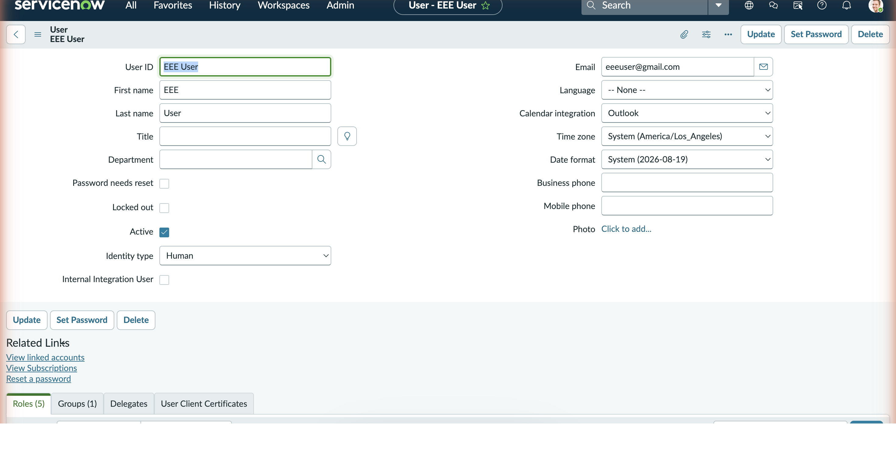

### Role creation

The brief describes creating each role under **User Administration > Roles > New**. We did this with one background script instead, `scripts/01_create_roles_and_assign.js`, so the four roles are identical and the step can be re-run safely.

1. The script looks up the `sys_user` record whose user_name is `EEE User`.
2. For each of `bb1`, `bb2`, `bb3` and `bb4` it checks `sys_user_role` for an existing role with that name and inserts one if missing, with Description "Custom role bbN for Script-Controlled ACL project".

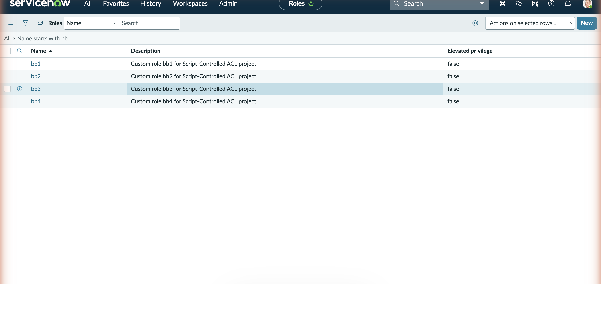

### Role assignment

3. In the same run, the script inserts a `sys_user_has_role` record for each role against EEE User, skipping any that already exist. After the run, EEE User holds bb1, bb2, bb3 and bb4.

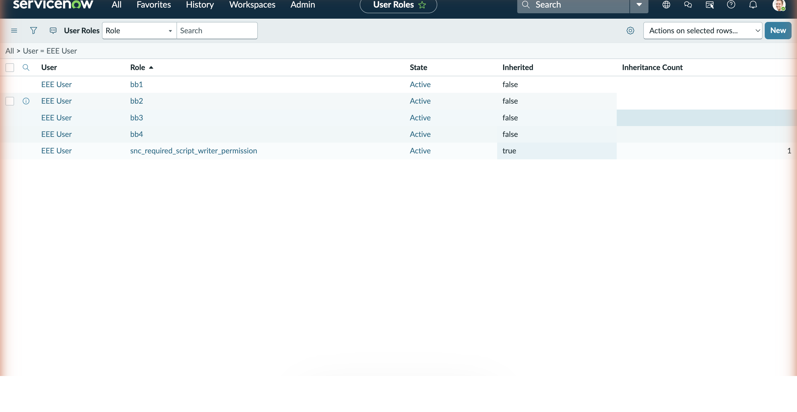

## Milestone-2: Tables Creation

### Table

1. Navigated to **System Definition > Tables** and clicked **New**.
2. Entered Label `Institution Details`; the Name filled in as `u_institution_details`. Extends table was left empty (no parent table).
3. Clicked **Submit**.

### Fields

The seven columns were added with `scripts/02_create_columns_and_branch_choices.js`, which inserts `sys_dictionary` rows for the table and then the three `sys_choice` values for Branch (sequence 100, 200, 300).

| Column label | Element | Type |
|---|---|---|
| Student Roll Number | `u_student_roll_number` | String (40) |
| Student Name | `u_student_name` | Reference to User |
| Faculty Name | `u_faculty_name` | Reference to User |
| Branch | `u_branch` | String (40) with choice list ECE, EEE, CSE |
| Email | `u_email` | String (100) |
| Phone Number | `u_phone_number` | String (40) |
| Description | `u_description` | String (4000) |

Note: the brief lists Student Roll Number as Auto Number and Description as Multi String. In our build both were created as String columns (max length 40 and 4000). Branch was created as a String column with an attached choice list (choice type 3) so it behaves as an ECE/EEE/CSE dropdown; the Dictionary Entries list shows its type as String. The other four fields match the brief exactly.

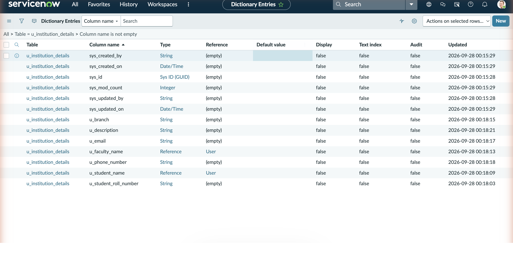

### Sample records

`scripts/03_insert_sample_records.js` inserted four records, one for each branch value plus a second EEE record, so that the read restriction has something to filter. Student Name and Faculty Name reference existing demo users on the instance.

| Roll No | Student Name | Faculty Name | Branch |
|---|---|---|---|
| ECE001 | Abel Tuter | Abraham Lincoln | ECE |
| EEE001 | Adela Cervantsz | Abraham Lincoln | EEE |
| EEE002 | Aileen Mottern | Abraham Lincoln | EEE |
| CSE001 | Alejandra Prenatt | Abraham Lincoln | CSE |

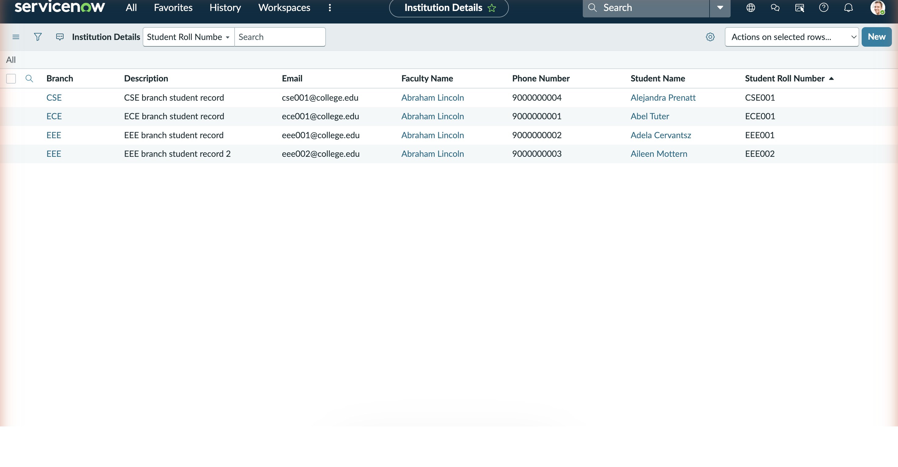

## Milestone-3: Read ACL

1. Elevated to `security_admin` from the user menu (**Elevate role**). ACL records cannot be edited without this.

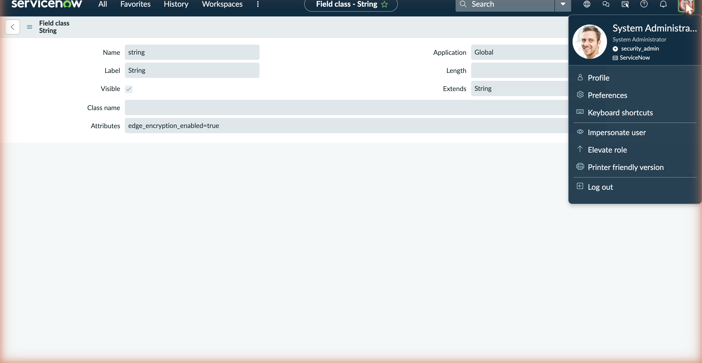

2. Navigated to **System Security > Access Control (ACL)**. Creating the table in Milestone-2 had already generated default record ACLs for all four operations on `u_institution_details`, each requiring a default role `u_institution_details_user`. Rather than adding a duplicate read ACL with **New**, we configured the existing one.
3. Ran `scripts/04_link_roles_to_acls.js` as a background script. It finds the record ACL with Operation read on `u_institution_details` and adds `bb1` to its Requires role list (`sys_security_acl_role`).
4. Ran `scripts/05_configure_read_acl_condition_and_script.js`. It sets Advanced to true, sets the Condition to `u_branch=EEE` (Branch is EEE), writes the script below into the Script field, keeps Active true, and deletes the default `u_institution_details_user` role link so that `bb1` is the only required role.

The resulting READ ACL (sys_id `179ff7d293e3471068e435018bba10a5`) has Type record, Operation read, Name u_institution_details, Active true, Advanced true, Decision Allow If, Requires role bb1, Condition Branch is EEE, and this script (`scripts/acl_read_script.js`):

```javascript
// Script on the READ ACL (u_institution_details, operation=read, Advanced=true)
// Requires role: bb1   |   Condition: Branch is EEE (u_branch=EEE)
(function () {
    // Allow admin users full access
    if (gs.hasRole('admin')) {
        return true;
    }
    // Allow only EEE branch users to see EEE records
    if (gs.hasRole('bb1')){
        return true;
    }
    // Deny access for all others
    return false;
})();
```

The two leading comment lines are annotations in the repository copy; the ACL Script field holds the function from `(function () {` to `})();`, exactly as set by `docScript` in `scripts/05_configure_read_acl_condition_and_script.js` and shown in the XML capture.

The condition and the script both have to pass. The condition narrows the rows to Branch = EEE, and the script then returns true for an admin or a bb1 holder and false for anyone else. A bb1 user therefore sees only EEE rows, and a user with no role sees nothing.

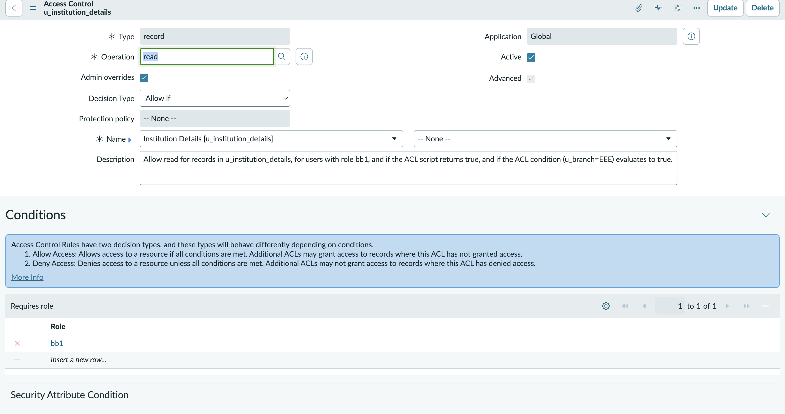

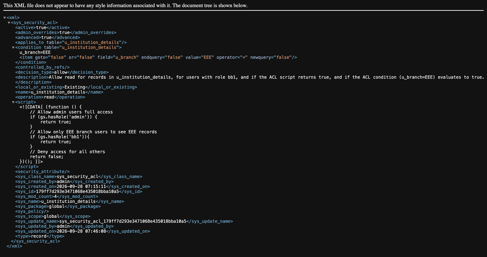

## Milestone-4: Create ACL

1. Still elevated to `security_admin`, the record ACL with Operation create on `u_institution_details` was configured by the same run of `scripts/04_link_roles_to_acls.js`: Type record, Operation create, Name u_institution_details, Active true, Requires role `bb2`.
2. No data condition and no script were added, as the brief specifies.
3. `scripts/05_configure_read_acl_condition_and_script.js` removed the default `u_institution_details_user` role from this ACL as well.

CREATE ACL sys_id: `ee9fb7d293e3471068e435018bba10de`. Its effect is confirmed live in Milestone-7 (the **New** button is available to EEE User); the `bb2` row also appears in the ACL-to-role links list under "ACL evidence: XML and role links" below.

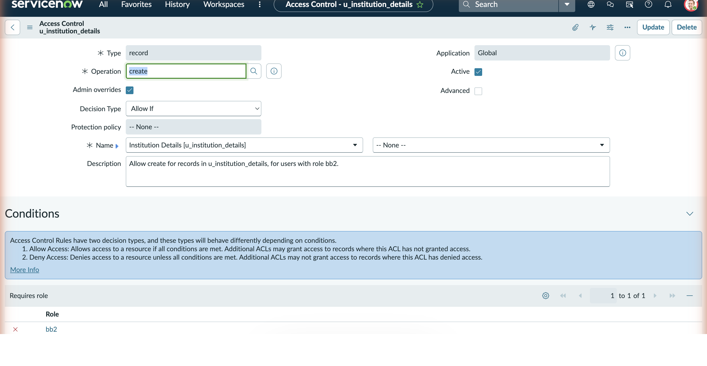

## Milestone-5: Write ACL

1. The record ACL with Operation write on `u_institution_details` was configured in the same way: Type record, Operation write, Name u_institution_details, Active true, Requires role `bb3`.
2. No data condition and no script.
3. Default `u_institution_details_user` role removed.

WRITE ACL sys_id: `44aff7d293e3471068e435018bba10ce`. Its effect is confirmed live in Milestone-7 (the **Update** button is available to EEE User on the record form); the `bb3` row also appears in the ACL-to-role links list below.

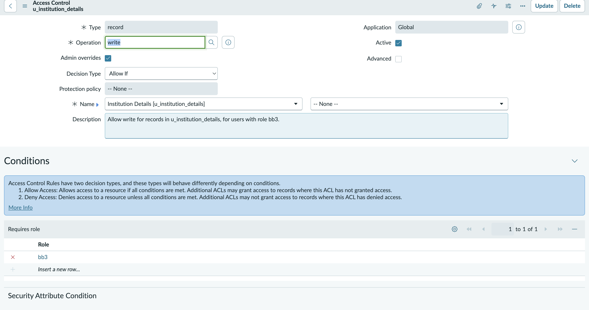

## Milestone-6: Delete ACL

1. The record ACL with Operation delete on `u_institution_details` was configured: Type record, Operation delete, Name u_institution_details, Active true, Requires role `bb4`.
2. No data condition and no script.
3. Default `u_institution_details_user` role removed.

DELETE ACL sys_id: `24af3bd293e3471068e435018bba1010`. Its effect is confirmed live in Milestone-7 (the **Delete** button is available to EEE User). The delete ACL is also visible in the XML export below (operation delete, advanced false, empty script), and `bb4` appears in the ACL-to-role links list.

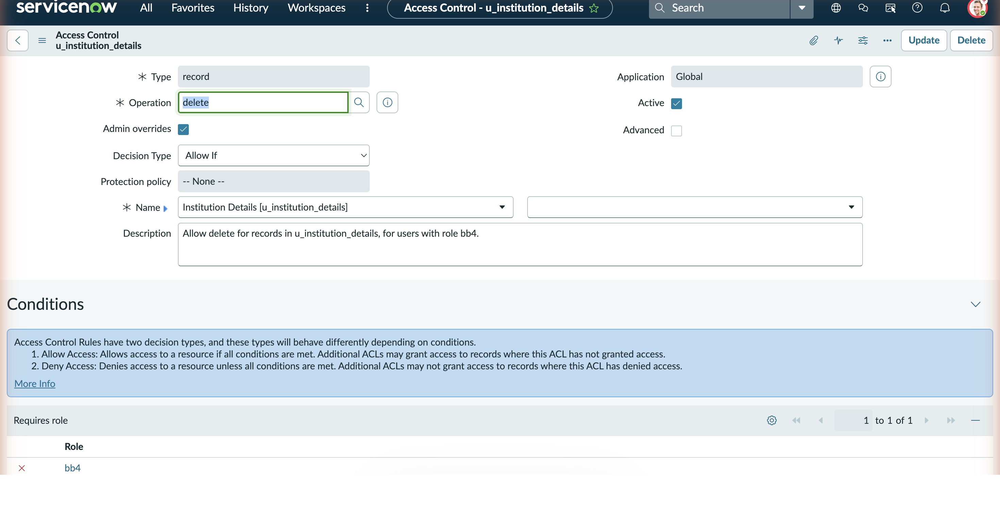

## ACL evidence: XML and role links

The XML export lists the `sys_security_acl` records on the table: the delete ACL (`operation` delete, `advanced` false, empty `script`) and the read ACL (`advanced` true, `condition` `u_branch=EEE`, and the script), plus the create ACL's sys_id. The Access Roles list shows the four role links, `bb1` to `bb4`, all on ACLs named `u_institution_details`.

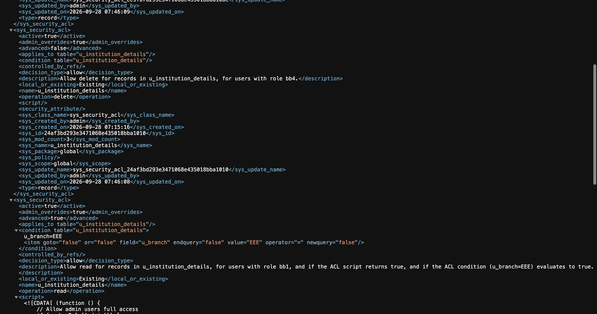

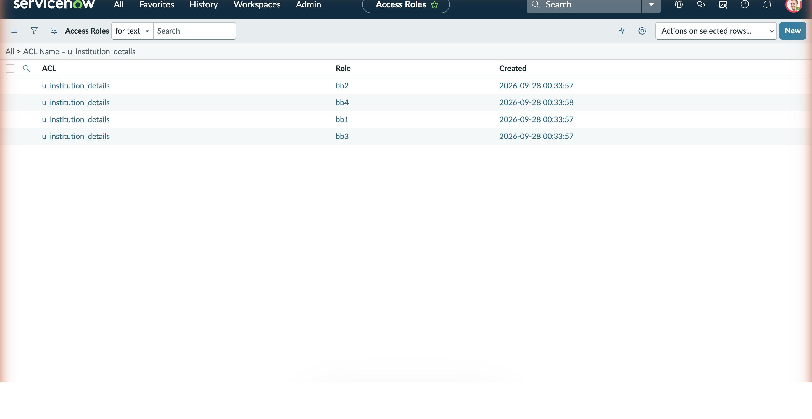

## Milestone-7: Verification

1. From the user menu chose **Impersonate user** and selected EEE User (who holds bb1 to bb4).
2. Opened the Institution Details list. Only EEE001 and EEE002 were shown (2 of 2 rows), and the **New** button was visible. This confirms the read ACL (bb1 plus Branch is EEE) and the create ACL (bb2).

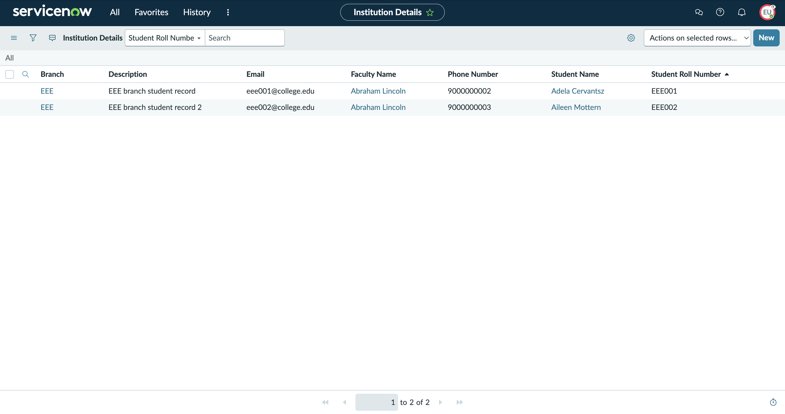

3. Opened EEE001. The form was editable and showed both **Update** and **Delete**, confirming the write ACL (bb3) and the delete ACL (bb4).

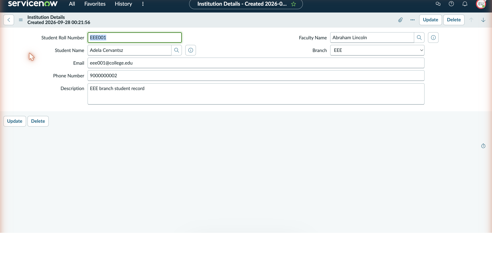

4. Ended impersonation and impersonated Abel Tuter, who has none of the bb roles. Opening the same list showed the message "Security constraints prevent access to requested page" instead of any records.

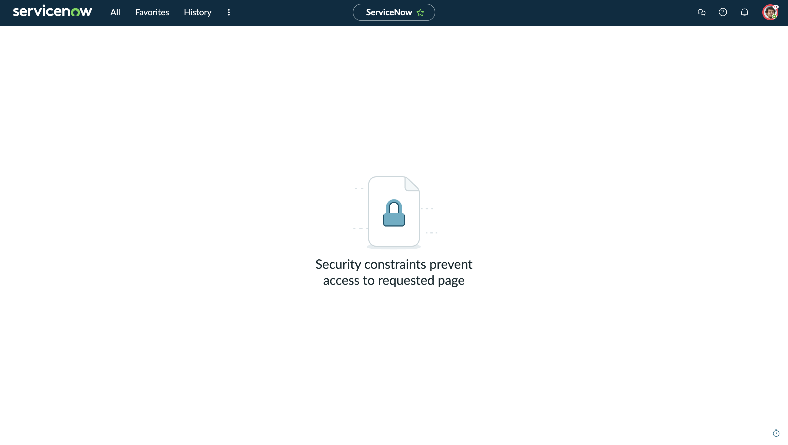

5. Ended impersonation and opened the list as System Administrator. All four records (CSE001, ECE001, EEE001, EEE002) were visible, matching the brief's requirement that administrators retain full access.

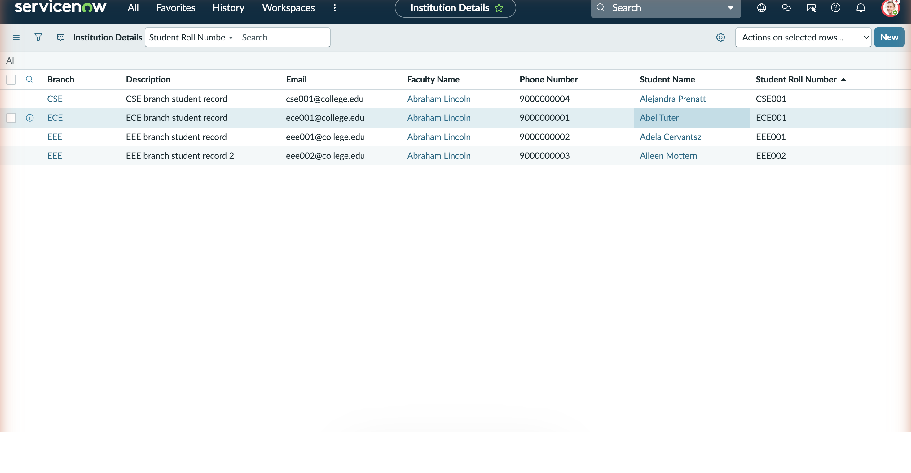

| User | Roles | Observed result |
|---|---|---|
| EEE User | bb1, bb2, bb3, bb4 | 2 EEE records only; New, Update and Delete available |
| Abel Tuter | none of the bb roles | "Security constraints prevent access to requested page" |
| System Administrator | admin | all 4 records visible |

## Outcome

The project shows how ServiceNow evaluates a role requirement, a data condition and a script together to reach a single access decision for each record. On `u_institution_details`, read is granted only when the user has bb1 and the record's Branch is EEE (or the user is an admin), while create, write and delete are each tied to their own role (bb2, bb3, bb4). Impersonation confirmed the three expected behaviours: a fully-roled user sees and can manage only the EEE records, a user with no role is blocked at the list, and the administrator sees everything. Along the way we also learned that creating a custom table auto-generates default ACLs with a `u_institution_details_user` role, which must be replaced rather than duplicated, and that `security_admin` elevation is required before any ACL change is accepted.

## How to reproduce

Log in to the instance as an admin. Background scripts are run from System Definition > Scripts - Background (paste the file contents, click Run script). Steps 1, 3, 6 and 9 are done in the ServiceNow UI (user form, table form, role elevation, impersonation); steps 2, 4, 5, 7 and 8 are background scripts.

1. UI: create the test user. User Administration > Users > New. User ID `EEE User`, First name `EEE`, Last name `User`, Email `eeeuser@gmail.com`. Save.
2. Scripts - Background: run `scripts/01_create_roles_and_assign.js`. Creates `bb1`, `bb2`, `bb3`, `bb4` and assigns all four to `EEE User`.
3. UI: create the table. System Definition > Tables > New. Label `Institution Details`, Name `u_institution_details`, Extends: none. Submit. ServiceNow auto-generates four default ACLs for the new table with a default role `u_institution_details_user`; steps 7 and 8 replace that role with the bb roles.
4. Scripts - Background: run `scripts/02_create_columns_and_branch_choices.js`. Adds Student Roll Number, Student Name, Faculty Name, Branch (ECE, EEE, CSE), Email, Phone Number and Description.
5. Scripts - Background: run `scripts/03_insert_sample_records.js`. Inserts ECE001, EEE001, EEE002 and CSE001, all with Faculty Name Abraham Lincoln.
6. UI: elevate to `security_admin` (user menu > Elevate role). Required before the next two scripts can write ACL records.
7. Scripts - Background: run `scripts/04_link_roles_to_acls.js`. Links `bb1` to the read ACL, `bb2` to create, `bb3` to write and `bb4` to delete.
8. Scripts - Background: run `scripts/05_configure_read_acl_condition_and_script.js`. Sets the read ACL to Advanced with condition `u_branch=EEE` and the script from `acl_read_script.js`, then removes `u_institution_details_user` from all four ACLs so each requires only its bb role.
9. Verify: impersonate `EEE User` and open the Institution Details list (expect EEE001 and EEE002 only, the New button, and Update and Delete on the form); impersonate `Abel Tuter` (expect the security constraints message); end impersonation and open the list as admin (expect all four records).
